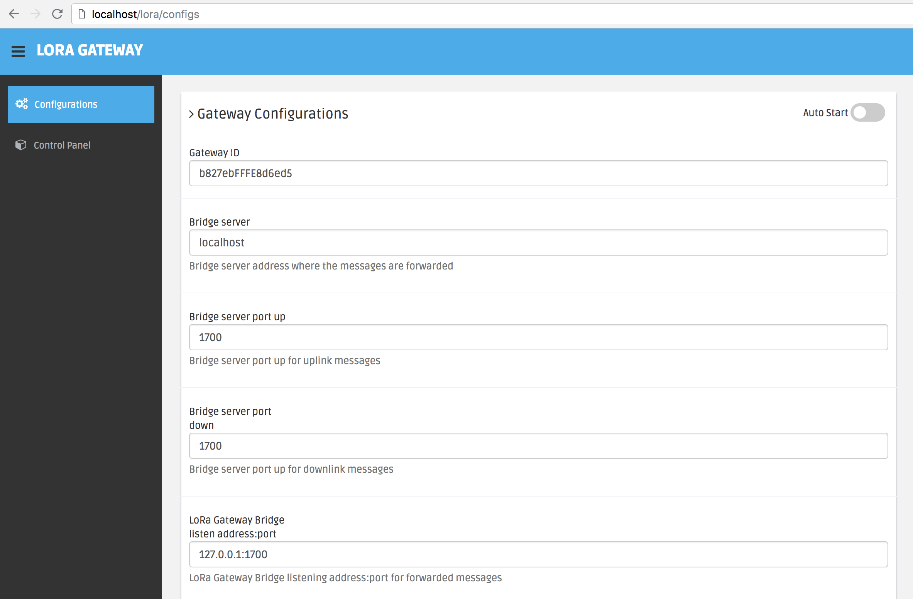
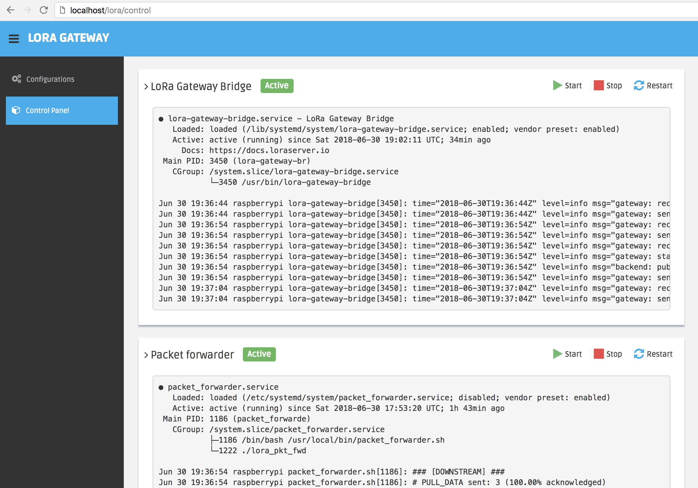

# LoRa Gateway <-> MQTT

## About
The scope of this project is to build nice looking Web Application on top of LoRa-Net Gateway ([1](https://github.com/Lora-net/packet_forwarder), [2](https://github.com/Lora-net/lora_gateway)) & LoRa Gateway Bridge ([3](https://github.com/brocaar/lora-gateway-bridge/)) to easily manage and monitor the gateway parameters.

## Web Application

### Configs (/configs)
Features offered by **/configs**:
- Gateway ID - unique identifier of the gateway (EUI64).
- Bridge server address and port up/down to forward
- Bridge listening address:port
- MQTT Broker - set the MQTT Broker address on which the gateway is connecting.
- MQTT Subscribe/Publish Topics - define the MQTT Topics on which the gateway is listening and publish data.

[](./public/img/gateway/config.png)

### Control Panel (/control)
Features offered by **/configs**:
- LoRa Gateway Bridge
- Packet Forwarder
- Gateway Registries values
- SPI status

[](./public/img/gateway/control.png)

## Development

##### Install environment
**macOS**
```
brew install nodejs nginx
git clone https://github.com/bogdanoniga/lora_gateway.git
cd ./lora_gateway
npm install
mv ./configs/nginx.conf /usr/local/etc/nginx/nginx.conf
```

**[Raspbian Stretch Lite (Raspberry Pi)](http://ftp.jaist.ac.jp/pub/raspberrypi/raspbian_lite/images/raspbian_lite-2018-03-14/)**
- Setting up your Raspberry Pi: [RPi setup](https://github.com/bogdanoniga/learning/blob/master/Raspberry/setup.md)

- Setting up LoRa Gateway: `./setup.sh`

- Start/Stop lora_gateway.service
```
sudo systemctl start lora_gateway.service
sudo systemctl stop lora_gateway.service
```

- Read lora_gateway.service logs
```
journalctl -u lora_gateway.service -f
```

- Set lora_gateway.service to run at startup
```
sudo systemctl enable lora_gateway.service
```

##### Start dev environment

```
# macOS
DEBUG=express-locallibrary-tutorial:* npm run devstart

# Raspbian
DEBUG=express-locallibrary-tutorial:* sudo npm run devstart
```

## Technical Stack

- LoRa-Net Gateway - https://github.com/Lora-net/packet_forwarder, https://github.com/Lora-net/lora_gateway
- LoRa Gateway Bridge - https://github.com/brocaar/lora-gateway-bridge/
- Express (nodejs) - https://github.com/expressjs/express
- Nginx - https://github.com/nginx/nginx
- Dashgum Bootstrap template - https://github.com/esironal/dashgum-template


## Todo
- [ ] Web Authentication Method (Login User/Pass, Identity Plus)
- [ ] Settings page (change user, pass, authentication method)

## MIT License

Copyright (c) 2018 Bogdan Oniga

Permission is hereby granted, free of charge, to any person obtaining a copy
of this software and associated documentation files (the "Software"), to deal
in the Software without restriction, including without limitation the rights
to use, copy, modify, merge, publish, distribute, sublicense, and/or sell
copies of the Software, and to permit persons to whom the Software is
furnished to do so, subject to the following conditions:

The above copyright notice and this permission notice shall be included in all
copies or substantial portions of the Software.

THE SOFTWARE IS PROVIDED "AS IS", WITHOUT WARRANTY OF ANY KIND, EXPRESS OR
IMPLIED, INCLUDING BUT NOT LIMITED TO THE WARRANTIES OF MERCHANTABILITY,
FITNESS FOR A PARTICULAR PURPOSE AND NONINFRINGEMENT. IN NO EVENT SHALL THE
AUTHORS OR COPYRIGHT HOLDERS BE LIABLE FOR ANY CLAIM, DAMAGES OR OTHER
LIABILITY, WHETHER IN AN ACTION OF CONTRACT, TORT OR OTHERWISE, ARISING FROM,
OUT OF OR IN CONNECTION WITH THE SOFTWARE OR THE USE OR OTHER DEALINGS IN THE
SOFTWARE.
